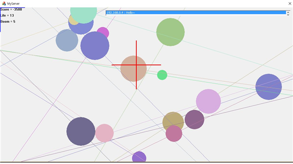
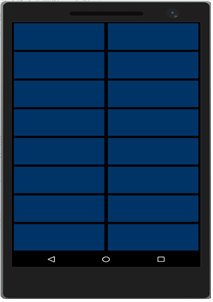

# 프로젝트 명 : VirtualGun
* Visual Studio 2015의 Cross platform기술을 이용한 FPS 게임

## 개발 환경
* Visual Studio 2015

## 프로젝트 선정 배경
* 클라이언트 프로그램은 Visual Studio 2015 개발툴의 Windows가 아닌 다른 OS의 앱을 개발할 수 있는 cross platform 기술을 이용한다. 
이 기술은 아직 함수나 여러 가지 지원 쪽에서 많이 부족함을 보이고 있으나 JAVA가 아닌 C++로 안드로이드 어플을 개발해봄으로써, 
native 언어의 활용성에 대해서 깨닫는 것에 큰 목표가 있다.
서버 프로그램은 MFC로 구현한다.

## 프로젝트 설명
* Android 스마트 폰 및 태블릿에 탑재된 센서를 활용하여 PC 와 연동하는 방식으로 개발되었다. 
이 게임은 혼자 또는 다수가 함께 즐길 수 있는 게임으로 Windows 운영체제가 설치된 PC 에서 실행되는 프로그램에 타겟이 보여지고, 
안드로이드 스마트 폰을 총이라고 가정하여 사용자가 PC 를 정면으로 바라본 상태에서 스마트 폰으로 타겟을 조준하고 특정 동작을 취하여 타겟을 제거하는 방식의 게임이다.

* 시연동영상

    
[시연동영상 바로가기](https://youtu.be/hC6w2bgZjSc)

* 윈도우 서버 프로그램 실행 화면

    

* 안드로이드 클라이언트 프로그램 실행 화면

    
